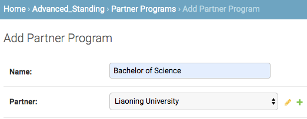
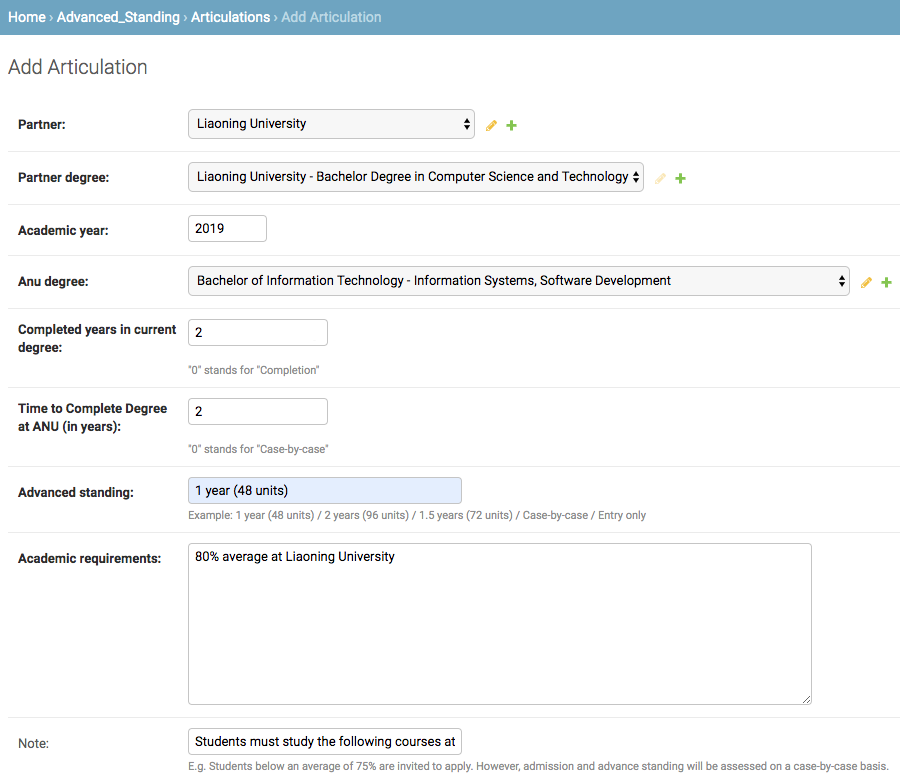
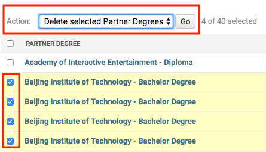

# Credit Transfer and Academic Planning System

This project is a web-based application that captures the details of academic articulation 
arrangements between ANU College of Engineering and Computer Science (CECS) and ANU partner 
institutions. The information can be accessed by students to know their advanced standing 
(credit transfer) details and get sample study plans; by relevant ANU academic staff (such 
as the Associate Directors and Program Convenors) and student administrators to advice 
students;  by CECS Marketing and external agents for marketing and advice; and by the other 
educational institutions for information. The site has two entry points, one is used for 
displaying the information and the other one (administration site) is used for managing the data.

## Table of Content
  * [Project Structure](#project-structure)
  * [Getting Started](#getting-started)
    + [Prerequisites](#prerequisites-dev)
    + [Installing](#installing-dev)
    + [Tips for development](#tips-for-development)
    + [UML Graph](#uml-graph)
    + [Extract course data completely from ANU course catalogue](#extract-course-data-completely-from-anu-course-catalogue)
  * [Deployment](#deployment)
    + [Prerequisites](#prerequisites-pro)
    + [Installing](#installing-pro)
  * [Features of the Pages](#features-of-the-pages)
    + [The general site](#the-general-site)
    + [The administration site](#the-administration-site)
      - [Search](#search)
      - [Filter](#filter)
      - [Bold Fields](#bold-fields)
      - [Change History](#change-history)
      - [Check & Cross Mark](#check-and-cross-mark)
  * [Q & A](#q-and-a)
    + [How to add new articulations efficiently?](#q-1)
    + [How to add new sample study plans?](#q-2)
    + [How to add course mappings (advanced standing details)?](#q-3)
    + [How to add required (compulsory) courses for a partner institution?](#q-4)
    + [How to add new group and user?](#q-5)
    + [How to change my password?](#q-6)
    + [How to change the badge of a partner institution?](#q-7)
    + [How to delete records?](#q-8)
  * [Useful Resources for Development](#useful-resources-for-development)
  * [Author](#author)
  * [Statement of Originality](#statement-of-originality)
  * [License](#license)
  * [Acknowledgments](#acknowledgments)


## Project Structure
<pre>
credit_transfer  
├── advanced_standing                The advanced standing app
│   ├── __init__.py  
│   ├── admin.py                     Register the models with the Django admin application
│   ├── apps.py                      Configuration file for this app
│   ├── config.py                    Define the prefixes of ANU urls
│   ├── migrations                   A directory for the data model migrations
│   ├── models.py                    Data models of the app
│   ├── tests.py                     Test cases
│   ├── urls.py                      Url configurations
│   ├── utils.py                     Utility functions
│   └── views.py                     Create the views of the app
├── credit_transfer  
│   ├── __init__.py  
│   ├── settings.py                  Settings for the project
│   ├── urls.py                      Project-level URL configurations
│   └── wsgi.py                      Enables WSGI compatible web servers to serve the project
├── import_data                      Scripts for importing data and some data files
│   ├── COMP courses - ANU.html      HTML file of COMP courses grapped from ANU
│   ├── ENGN courses - ANU.html      HTML file of ENGN courses grapped from ANU
│   ├── MATH courses - ANU.html      HTML file of MATH courses grapped from ANU
│   ├── PHYS courses - ANU.html      HTML file of PHYS courses grapped from ANU
│   ├── STAT courses - ANU.html      HTML file of STAT courses grapped from ANU
│   ├── __init__.py  
│   ├── anu_course.txt               Special courses of ANU
│   ├── anu_major_or_spec.txt        Data of ANU major and specialisations
│   ├── anu_program.txt              Data of ANU Programs
│   ├── badges                       A directory for the institution badges
│   ├── comp_course.txt              Code and name of ENGN courses
│   ├── country.txt                  Data of the countries/regions
│   ├── engn_course.txt              Code and name of ENGN courses
│   ├── extract_anu_courses.py       Script for extracting data from HTML files
│   ├── import_data.py               Import data from the text files to the database
│   ├── math_course.txt              Code and name of MATH courses
│   ├── partner.txt                  Data of ANU partner institutions
│   ├── phys_course.txt              Code and name of PHYS courses
│   ├── refresh_badges.py            Refresh the badges after first time importing   
│   └── stat_course.txt              Code and name of STAT courses
├── logs                             Directory reserved for Nginx logs
├── manage.py                        Command-line utility for executing Django commands  
├── media                            Media root of the project
│   └── institution_badge            The institution badges will be saved here
├── requirements.txt                 Required packages and their versions
├── secret_key                       A secret key for a particular Django installation
├── static                           Static files (images, CSS)
│   ├── css  
│   │   └── style.css  
│   └── images  
└── templates                        HTML templates
    ├── admin                        Overide the template of admin domain
    │   └── base_site.html  
    └── advanced_standing            Templates for the APP: advanced_standing
        ├── articulations.html  
        ├── base.html  
        ├── index.html  
        ├── partner_degrees.html  
        ├── partners.html  
        └── study_plans.html  
</pre>

---

## Getting Started

These instructions will get you a copy of the project up and running on your local machine for 
development and testing purposes. See deployment for notes on how to deploy the project on a 
live system.

<a name="prerequisites-dev"></a>
### Prerequisites

What things you need to install the software and how to install them

1. **Python 3**: download from https://www.python.org/downloads/  
    To avoid any incompatibility issues, I recommend you to use **Python 3.6**  
    
    Or you can use Anaconda:
      
    **Anaconda Distribution - Python 3**: download from https://www.anaconda.com/distribution/#download-section  

2. **PostgreSQL**: download from https://www.postgresql.org/download/  
    If you are using a Mac, I strongly recommend you to install [Postgres.app](https://postgresapp.com/) 
    which is a full-featured PostgreSQL installation packaged as a standard Mac app.

<a name="installing-dev"></a>
### Installing

A step by step series of examples that tell you how to get a development env running

1. Clone this repository to your local with HTTPS.
    ```bash
    $ git clone https://gitlab.cecs.anu.edu.au/u6158063/credit-transfer.git
    ```  

2. Create a database called `advanced_standing` in your PostgreSQL.
    ```sql
    CREATE DATABASE advanced_standing;
    ```

3. Go to `credit_transfer/credit_transfer` directory and edit `settings.py`, 
change the values of `USER` and `PASSWORD` in `DATABASES` to yours.

4. Import the data file `postgres_data/data19052019.pgsql` 
to your local database.
    ```bash
    $ psql -U YourUserName advanced_standing < data19052019.pgsql
    ```

5. Create a virtual environment (say `env`) for this project. You can 
use either `venv` or `virtualenv` module of Python 3 to create one.  
    An example for Anaconda user:
    ```bash
    $ conda create -n env python=3.6
    ```
6. Then activate the virtual environment.  
    For Mac and Linux user:
    ```bash
    $ source activate env
    ```
    For Windows user (in the command window):
    ```
    activate env
    ```

7. Install the required packages listed in `credit_transfer/requirements.txt` 
to your virtual env.
    ```bash
    (env) $ pip install -r requirements.txt
    ```

8. Fix a bug in the package `django-smart-select` by replacing a file in 
your virtual env with a correct one.  
**Note that this step is very IMPORTANT.**  
Replace `chainedfk.js` located at `path-to-your-env/lib/python3.6/site-packages/smart_selects/static/smart-selects/admin/js/chainedfk.js`
with the fixed file which you can download at `https://github.com/realmadrid/django-smart-selects/blob/master/smart_selects/static/smart-selects/admin/js/chainedfk.js`.  

9. Import the badge images of ANU partner institutions. Run the script in 
`credit_transfer/import_data/refresh_badges.py`.
    ```bash
    (env) $ python refresh_badges.py
    ```
    Sample output:
    ```
    [Partner]: Begin persisting Partner...
    [Partner]: 30 records found in the data file.
    [Partner]: Persisting data finished. 30 records in total. 30 new institution badges added.
    ```

10. Create a superuser of Django to login the admin site. Go to the directory 
of `credit_transfer/manage.py` and run the command:  
    ```bash
    (env) $ python manage.py createsuperuser
    ```
    Enter your username, email and password.

11. Starts a lightweight development Web server on the local machine. 
By default, the server runs on port 8000 on the IP address 127.0.0.1. 
You can pass in an IP address and port number explicitly. Go to the 
directory `credit_transfer/manage.py` and run the command:
    ```bash
    (env) $ python manage.py runserver
    ```
    + Now the server’s running, visit **http://127.0.0.1:8000/advanced_standing** 
    with your Web browser.  
    
    + The administration site is available at **http://127.0.0.1:8000/admin**,
    use your account created at the previous step to login.
    


### Tips for development
+ When developing, make sure in `credit_transfer/settings.py`, you comment 
the variable `STATIC_ROOT` and uncomment `STATICFILES_DIRS`, and `DEBUG = True`
+ After you modify the data models in `credit_transfer/advanced_standing/models.py`, 
remember to make migrations to apply your changes:
    ```bash
    (env) $ python manage.py makemigrations
    (env) $ python manage.py migrate
    ```
+ Read [Django 2.2 documentation](https://docs.djangoproject.com/en/2.2/)

### UML Graph
The data model files are available at directory `doc/data model evolution`. The XML files 
of data model v0.1-v0.5 can be opened and edited by **draw.io** which is a free and open source 
software.  
+ [draw.io - online version](https://www.draw.io/)
+ Desktop versions for all platforms can be downloaded [here](https://about.draw.io/integrations/).

From v0.6, the data models are created by **[StarUML](http://staruml.io/)**.  
StarUML is a sophisticated software modeler for agile and concise modeling.  
+ Download [StarUML 3 for macOS](http://staruml.io/download/releases/StarUML-3.1.0.dmg) (needs macOS 10.9 or higher)
+ Download [StarUML 3 for Windows](http://staruml.io/download/releases/StarUML%20Setup%203.1.0.exe) (needs Windows 7 or higher)
+ Download [StarUML 3 for Linux 64-bit](http://staruml.io/download/releases/StarUML-3.1.0-x86_64.AppImage)

The latest version (v1.0) of UML graph is shown bellow:  
    

### Extract course data completely from ANU course catalogue
The script `credit_transfer/import_data/extract_anu_courses.py` is used for 
extracting code and name of ANU courses to text files using `BeautifulSoup`. 
You can follow the instructions below to extract any other course series. Note 
that I don't recommend you to add too many courses to the project because many 
courses are not relevant to advanced standing. The COMP and ENGN courses are 
basically enough.
1. Go to the `Courses` tab in https://programsandcourses.anu.edu.au/catalogue, 
search anyone of COMP/ENGN/MATH/PHYS/STAT and click `show all results` at the bottom of the page. 
2. Save the HTML page to `credit_transfer/import_data` and rename it like 
`COMP courses - ANU.html`.
3. Run `python extract_anu_courses.py` and the text files will be generated.

---

## Deployment

Additional notes about how to deploy this on a live system

<a name="prerequisites-pro"></a>
### Prerequisites
+ A server with any Linux distribution installed. Here I use 
**Ubuntu Server 18.04** for an example.  
+ Install Python 3.6
    ```bash
    $ sudo apt-get python3.6
    ```
+ Install PostgreSQL
    ```bash
    $ sudo apt update
    $ sudo apt install postgresql postgresql-contrib
    ```
+ Install Nginx
    ```bash
    $ sudo apt-get install nginx
    ```

<a name="installing-pro"></a>
### Installing

A step by step series of examples that tell you how to deploy the project

1. Clone this repository to your server with HTTPS.
    ```bash
    $ git clone https://gitlab.cecs.anu.edu.au/u6158063/credit-transfer.git
    ```  

2. Create a database called `advanced_standing` in the PostgreSQL.
    ```sql
    CREATE DATABASE advanced_standing;
    ```

3. Go to `credit_transfer/credit_transfer` directory and edit `settings.py`:  
    + Change the values of `USER` and `PASSWORD` in `DATABASES` to yours.
    + Change the value of `DEBUG` from `True` to `False`.
    + Uncomment `STATIC_ROOT` and comment `STATICFILES_DIRS`.

4. Import the data file `postgres_data/data19052019.pgsql` 
to your local database.
    ```bash
    $ psql -U YourUserName advanced_standing < data19052019.pgsql
    ```

5. Create a virtual environment (say `env`) for this project.  
    ```bash
    $ virtualenv --python=/usr/bin/python3.6 env
    ```
6. Then activate the virtual environment.  
    ```bash
    $ source env/bin/activate
    ```

7. Install the required packages listed in `credit_transfer/requirements.txt` 
to your virtual env.
    ```bash
    (env) $ pip install -r requirements.txt
    ```

8. Fix a bug in the package `django-smart-select` by replacing a file in 
your virtual env with a correct one.  
**Note that this step is very IMPORTANT.**  
Replace `chainedfk.js` located at `path-to-your-env/lib/python3.6/site-packages/smart_selects/static/smart-selects/admin/js/chainedfk.js`
with the fixed file which you can download at `https://github.com/realmadrid/django-smart-selects/blob/master/smart_selects/static/smart-selects/admin/js/chainedfk.js`.  

9. Import the badge images of ANU partner institutions. Run the script in 
`credit_transfer/import_data/refresh_badges.py`.
    ```bash
    (env) $ python refresh_badges.py
    ```
    Sample output:
    ```
    [Partner]: Begin persisting Partner...
    [Partner]: 30 records found in the data file.
    [Partner]: Persisting data finished. 30 records in total. 30 new institution badges added.
    ```

10. Create a superuser of Django to login the admin site. Go to the directory 
of `credit_transfer/manage.py` and run the command:  
    ```bash
    (env) $ python manage.py createsuperuser
    ```
    Enter your username, email and password.

11. Collect static files of the project:
    ```bash
    (env) $ python manage.py collectstatic
    ```

12. Create Nginx Configuration file. You can refer to the file located at 
`doc/nginx-sample-config.conf`.
    ```bash
    $ vim /etc/nginx/sites-available/anu-nginx.conf
    ```
    <pre>
    upstream app_server {
        server 0.0.0.0:8000;  # Must be consistent with where gunicorn bind
    }
    
    server {
        charset utf-8;
        listen 80;
        server_name xxx.xxx.xxx.xxx;  # Your server ip here
    
        # Logs
        access_log /home/ubuntu/credit-transfer/credit_transfer/logs/nginx.access.log;
        error_log /home/ubuntu/credit-transfer/credit_transfer/logs/nginx.error.log;
    
        location = /favicon.ico { access_log off; log_not_found off; }
    
        location /static {
            alias /home/ubuntu/credit-transfer/credit_transfer/static;
        }
        location /media {
            alias /home/ubuntu/credit-transfer/credit_transfer/media;
        }
        location / {
            proxy_pass http://app_server;
            proxy_set_header Host $host;
            proxy_set_header X-Real-IP $remote_addr;
            proxy_set_header X-Forwarded-For $proxy_add_x_forwarded_for;
        }
    }
    </pre>
    
    + Then create a symbolic link and enable the config
    ```bash
    $ sudo ln -s /etc/nginx/sites-available/anu-nginx.conf /etc/nginx/sites-enabled/anu-nginx.conf
    ```
    
    + Test your config file is correct
    ```bash
    $ sudo nginx -t
    ```
    
    + Restart Nginx
    ```bash
    $ sudo service nginx restart
    ```

13. Go to the directory of `manage.py` and start the `gunicorn` in the background
    ```bash
    nohup gunicorn credit_transfer.wsgi:application --bind 127.0.0.1:8000 --workers=3 --name advanced_standing &> /dev/null &
    ```

---

## Features of the Pages
### The general site
Most of the ANU courses, programs, majors, specialisations are clickable, which will 
redirect to the corresponding pages of ANU.  

### The administration site
#### Search
All the key fields of the data are searchable via the search box on the top left corner of 
the pages. Your query text is case insensitive and you can just search a part of the keywords. 
For example, the `abbreviation` of `Shandong Univeristy Weihai` is `SDUW`. Then we just search 
`sd` in the Articulation page and all the relevant records of `Shandong Univeristy Weihai` will 
be displayed.

#### Filter
Filters are available in the right sidebar of the change list pages of the admin, as illustrated below. 
You can use a combination of filters to get specific results.  

#### Bold Fields
The bold fields in each page mean that they are required field. The others are optional.  

#### Change History
In the detail page of any record, the admin can view the change history by the `HISTORY` 
button on the top right corner, which will display the date/time, users and actions of the changes.  

#### Check and Cross Mark
The admins can easily check whether the `BADGE` and `WEBSITE` fields of the partners have 
been added. The green check mark means the field has been filled and the red cross mark means 
absent field.
  

---

<a name="q-and-a"></a>
## Q & A
<a name="q-1"></a>
### How to add new articulations efficiently?
When you want to add new articulations between ANU and one partner institution, 
1. Login your account in the administration site
2. Open **4** tabs in your Chrome for
    + Partner Program Page: http://localhost:8000/admin/advanced_standing/partnerprogram/
    + Partner Degree Page: http://localhost:8000/admin/advanced_standing/partnerdegree/
    + ANU Degree Page: http://localhost:8000/admin/advanced_standing/anudegree/
    + Articulation Page: http://localhost:8000/admin/advanced_standing/articulation/  
    
    (Replace `localhost:8000` in the urls to your real address)
3. For such an articulation (cropped from [a PDF file](https://cecs.anu.edu.au/sites/default/files/university-partnership/liaoning_advanced_standing_flyer-_august_2017.pdf)) with Liaoning University of China,  
      
    With referencing to the articulation above
    + Add Partner Program in the 1st tab if it not exists  
      
    + Add Partner Degree in the 2nd tab if it not exists.  
    If the degree has multiple majors, just enter one major each line in the `Major(s)` field.    
      
    + Add ANU Degree in the 3rd tab if not exists. After searching the keywords 
    in the search box, we have found that the ANU Degree with majors Information 
    System and Software Development, so just skip this step.  
      
    If you want to add a new one with more than one major/specialisation, just 
    hold down "Control", or "Command" on a Mac, to select more than one.
    + Add an articulation in the 4th tab  
    
    + Let's view the articulation we just added  
      
    + It would be very fast when you get familiar with this workflow.  

<a name="q-2"></a>
### How to add new sample study plans?
When you want to add new sample study plans after adding an articulation, 
1. Login your account in the administration site
2. Open the Study Plan Page (replace `localhost:8000` in the urls to your real address): http://localhost:8000/admin/advanced_standing/studyplan/
3. For such a sample study plan (cropped from [a PDF file](https://cecs.anu.edu.au/sites/default/files/university-partnership/liaoning_advanced_standing_flyer-_august_2017.pdf)) for an articulation of Liaoning University of China,  
      
    With referencing to the information above  
    + Add a new sample study plan. The first three dropdown lists are chained, you won't get too many choices.    
    Note that **one course each line** in the text areas.  
      
    + Let's view the sample study plan we just added  
      
    You can notice that the update time has been automatically recorded.  

<a name="q-3"></a>
### How to add course mappings (advanced standing details)?
1. Go to `Partner` page and edit the `Course mappings` field. Each line is a mapping in the following format:  
    `ANU course code;Partner course name 1;Partner course name 2;...`  
    One ANU course code followed by the partner course names, split by semicolon(;).
    E.g. `COMP1110;Object Oriented Programming;Data Structure`  
      
2. Go to `Articulation` page, select the target articulation record and edit the 
    `Advanced standing details` field. Hold down "Control", or "Command" on a Mac, to select more than one.  
3. The course mappings would be processed by the program and look like this:  
      

<a name="q-4"></a>
### How to add required (compulsory) courses for a partner institution?
Go to `Parnter Degrees › XXX University` and edit the `Required courses` field 
and `Required courses note` (optional) field. As before, hold down "Control", 
or "Command" on a Mac, to select more than one.

<a name="q-5"></a>
### How to add new group and user?
**Add new group**:  

Go to `Authentication and Authorization › Groups › Add group`, select some permissions and add
them to the right side, and save it.  
  

**Add new user**:  

1. Go to `Authentication and Authorization › Users › Add user` and add a user.  
    Note that for the username should be
    + 150 characters or fewer
    + Letters, digits and @/./+/-/_ only  
        
    For security consideration, the password:  
    + Can't be too similar to your other personal information
    + Must contain at least 8 characters
    + Can't be a commonly used password
    + Can't be entirely numeric  
    
    Raw passwords are not stored, so there is no way to see this user's password. The password will be 
    hashed by `pbkdf2_sha256 algorithm` for 150,000 iterations, with salt added.  

2. Edit the personal information (name & email) and determine the checkboxes for permissions:  
    + **Active**: Designates whether this user should be treated as active. Unselect this instead of deleting accounts.  
    + **Staff status**: Designates whether the user can log into this admin site.  
    + **Superuser status**: Designates that this user has all permissions without explicitly assigning them.  
    
    
    Determine the permissions on the data of the user, I recommend you to select a group:  
    

<a name="q-6"></a>
### How to change my password?
Click `CHANGE PASSWORD` on the top right corner of the site.

<a name="q-7"></a>
### How to change the badge of a partner institution?
Go to the bottom of partner details page, choose a new image and click `SAVE` to override the current one.  


<a name="q-8"></a>
### How to delete records?
+ **Delete one record**  
    In the detail page of a record, click the `Delete` button on the bottom left corn of the page.  
+ **Delete multiple records**  
    In a change list page of the admin, check the records that need to be deleted and select `delete` option 
    in `Action`.  
    

---

## Useful Resources for Development
+ [Django 2.2 documentation](https://docs.djangoproject.com/en/2.2/)
+ [Use Gunicorn behind Nginx](http://docs.gunicorn.org/en/stable/deploy.html#nginx-configuration)
+ [Nginx Beginner’s Guide](http://nginx.org/en/docs/beginners_guide.html)
+ [Postico: A Modern PostgreSQL Client for the Mac](https://eggerapps.at/postico/)

## Author

**Haotian Shi**  
Email: realmadrid.anu@gmail.com  
Research School of Computer Science, Australian National University

## Statement of Originality

This project is my own original work, with the following exceptions:  
+ The text in the index.html and ANU logo images referred from https://cecs.anu.edu.au/study/advanced-standing
+ The banner image in the middle of index.html is downloaded from the [Facebook of CECS](https://www.facebook.com/anu.cecs/)
+ The data file of postgreSQL was produced according to the data of 
[CECS - Advanced standing](https://cecs.anu.edu.au/study/advanced-standing) 
and [ramesh - articulation](https://users.cecs.anu.edu.au/~ramesh/programs/articulation/)


## Acknowledgments

+ For **Ramesh Sankaranarayana**, who gave me a lot of advices and strong support 
on the project, and encouraged me when I was in trouble.
+ For **Shayne Flint**, who made me get a better understanding on data models 
and helped me revise the models.
+ For **Johan Arnberg**, who gave me feedback and helped me seek technical support.
+ For **Paul Melloy**, who gave me feedback and advices.
+ For **Robert Edwards**, who offered support on setting up the VM of the college.
+ For **my parents**, who enable me to get here.
+ For **Yuke Lu**, who always believes in me and brings me inspirations.
